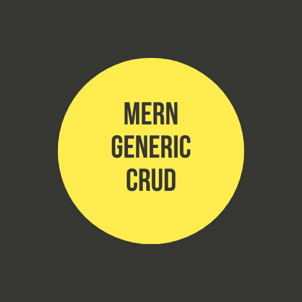
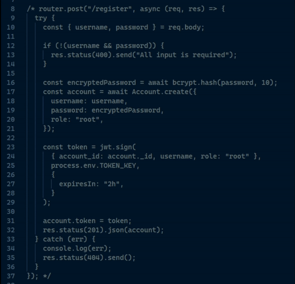
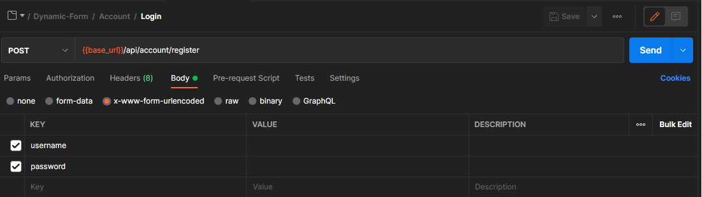

<div align="center">
    
  </a>

  <h3 align="center">MERN GENERIC CRUD</h3>

  <p align="center">
    An awesome tool for create your own forms!
    <br />
</div>

<!-- ABOUT THE PROJECT -->

## About The Project

This is a dynamic form creation project which is developed with MERN stack.
The project allows to users create a forms and assing new admins to that forms by permissions.

<p align="right">(<a href="#top">back to top</a>)</p>

### Built With

-   [MongoDB](https://www.mongodb.com/)
-   [Express.js](https://expressjs.com/)
-   [React.js](https://reactjs.org/)
-   [Node.js](https://nodejs.org/en/)

<p align="right">(<a href="#top">back to top</a>)</p>

<!-- GETTING STARTED -->

## Getting Started

If you want to setup the project on your local network you can follow the instructions below.

### Prerequisites

First requirement is Node package manager. Npm allows to install and manage the packages on your project. So you can download the node from link below.

-   [Node.js](https://nodejs.org/en/)

The other requirement is MongoDB community server. You should download and install it. After installation don't forget to add mongo.exe's path to your computer's environment variables.

-   [MongoDB](https://www.mongodb.com/try/download/community)

### Installation

1. Clone the repository
    ```sh
    git clone https://github.com/yreisoglu/mern-generic-crud
    ```
2. Go to project path and run this command below this is going to install both packages for client and server.
    ```sh
    cd server && npm install && cd .. && cd client && npm install
    ```
3. Create .env files for client and server. (You can create your own random keys)

    ```js
    // server/.env
    TOKEN_KEY = 'RANDOM ANY STRING'
    USERS_SECRET_KEY = 'RANDOM ANY STRING'
    ```

    ```js
    // client/.env
    ESLINT_NO_DEV_ERRORS = true
    DISABLE_ESLINT_PLUGIN = true
    REACT_APP_API_URL = 'http://localhost:5000'
    ```

    If you follow the steps correctly your project must be installed. Now we have to create an root level user. For that you can follow the instructions below.

<p align="right">(<a href="#top">back to top</a>)</p>

### Account Creation

In this project we have 2 types of account. First one is root user the other one is admin user. The root users can create admin accounts and give them permission for forms. Thus we need a root level account.

#### Root Level User Creation

In server we have an endpoint for root level user creation. That endpoint is covered with comments initially because we don't want to create root accounts more than one so for one time we are gonna uncomment that section.

<br/>
<div align="center">

</div>
After that you can make a request to the api with username and password. Once root level user has been created, you should cover with comment the register code block.

<br/>
<div align="center">

</div>

 <br>

### Starting the project

After all operations your project is ready for start on your local. 

```js
// client start
cd client && npm start
```

```js
// server start
cd server && npm start
```

### API Documentation

[You can find the Postman api collection here](/readme/CRUD.postman_collection.json)